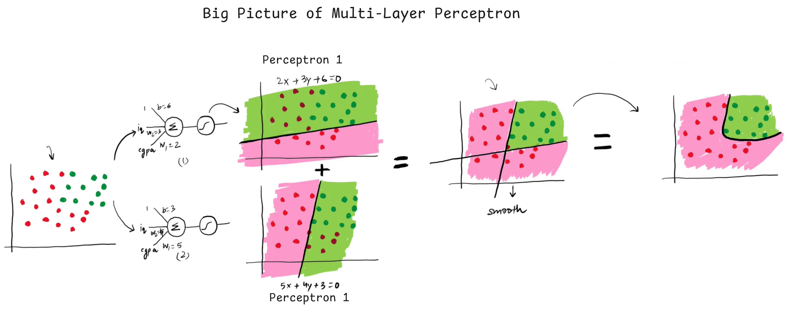

# **2. Deep Learning: An Overview**

## **Introduction**  
Deep Learning (DL) is a subfield of Artificial Intelligence (AI) and Machine Learning (ML) inspired by the structure and function of the human brain. Deep learning algorithms aim to mimic human decision-making by processing data through artificial neural networks (ANNs). While traditional ML relies on statistical techniques, deep learning leverages hierarchical neural architectures to automatically learn feature representations from raw data.

## **Neural Network Types**  
Deep learning employs various neural network architectures, including:  
- **ANN (Artificial Neural Networks)** – Basic feedforward networks for general-purpose learning.  
- **CNN (Convolutional Neural Networks)** – Specialized for image and spatial data processing.  
- **RNN (Recurrent Neural Networks)** – Designed for sequential data like text and time series.  
- **GAN (Generative Adversarial Networks)** – Used for generating synthetic data through adversarial training.  

## **Why Deep Learning is Gaining Prominence**  
1. **Broad Applicability**  
   - Effective across diverse domains such as computer vision, natural language processing (NLP), speech recognition, and autonomous systems.  
2. **Superior Performance**  
   - Achieves state-of-the-art results, often surpassing human-level accuracy in tasks like image classification (e.g., AlphaGo, medical diagnostics).  

## **Representation Learning**  
Deep learning automates **feature extraction** through multiple neural network layers:  
- **Lower layers** detect primitive features (e.g., edges in images).  
- **Higher layers** recognize complex concepts (e.g., objects, faces, or text semantics).  
This eliminates the need for manual feature engineering, allowing models to learn and optimize features directly from raw data.  

## **Deep Learning vs. Machine Learning**  

| **Aspect**          | **Deep Learning**                          | **Machine Learning**                     |
|----------------------|--------------------------------------------|------------------------------------------|
| **Data Dependency**  | Requires large datasets                   | Works well with smaller datasets         |
| **Hardware Needs**   | High (GPUs/TPUs essential)                | Moderate (CPU often sufficient)          |
| **Training Time**    | Longer due to complex architectures       | Faster (depending on the algorithm)      |
| **Feature Selection**| Automatic feature extraction              | Manual feature engineering required      |
| **Interpretability** | Less interpretable (black-box nature)     | More interpretable (e.g., decision trees)|

**Note:** Deep learning is not a universal replacement for ML—some tasks still require simpler, more efficient ML models.  

## **Factors Driving Deep Learning’s Popularity**  
1. **Hardware Advancements**  
   - **GPUs (NVIDIA CUDA)**, **FPGAs**, and specialized AI chips (**TPUs, NPUs**) accelerate training.  
2. **Availability of Large Datasets**  
   - Public datasets like **Microsoft COCO (images), YouTube-8M (videos), SQuAD (text), and Google Audioset** facilitate research.  
3. **Powerful Frameworks**  
   - **TensorFlow, PyTorch, AutoML** simplify model development.  
4. **Strong Research Community**  
   - Open-source contributions from **Google, Microsoft, and academia** accelerate innovation.  
5. **Advanced Architectures**  
   - Pre-trained models improve efficiency across tasks:  
     - **Image Classification:** ResNet  
     - **Text Processing:** BERT  
     - **Image Segmentation:** U-Net  
     - **Image Translation:** Pix2Pix  
     - **Object Detection:** YOLO  
     - **Speech Synthesis:** WaveNet  

# **2. Types of Neural Networks**  

## **2.1 Types of Neural Networks**  

### **1. Multi-Layer Perceptron (MLP)**  
- **Type:** Feedforward neural network  
- **Learning:** Supervised  
- **Use Case:** Regression, classification, and basic pattern recognition  
- **Characteristics:**  
  - Simplest form of an artificial neural network (ANN)  
  - Consists of an input layer, one or more hidden layers, and an output layer  
  - Uses backpropagation for training  

### **2. Convolutional Neural Network (CNN)**  
- **Type:** Feedforward neural network  
- **Learning:** Supervised  
- **Use Case:** Image and video processing (object detection, classification, segmentation)  
- **Characteristics:**  
  - Uses convolutional layers to detect spatial hierarchies (edges, textures, shapes)  
  - Includes pooling layers for dimensionality reduction  
  - Popular architectures: ResNet, VGG, AlexNet  

### **3. Recurrent Neural Network (RNN)**  
- **Type:** Feedback neural network  
- **Learning:** Supervised/Unsupervised  
- **Use Case:** Sequential data (text, speech, time series)  
- **Characteristics:**  
  - Processes sequences using loops (memory of previous inputs)  
  - Suffers from vanishing/exploding gradients  
  - Variants: LSTM (Long Short-Term Memory), GRU (Gated Recurrent Unit)  

### **4. Autoencoder**  
- **Type:** Unsupervised neural network  
- **Learning:** Self-supervised (reconstructs input)  
- **Use Case:** Dimensionality reduction, denoising, anomaly detection  
- **Characteristics:**  
  - Symmetric architecture (encoder compresses, decoder reconstructs)  
  - Used in generative models and feature extraction  

### **5. Generative Adversarial Network (GAN)**  
- **Type:** Generative neural network  
- **Learning:** Unsupervised  
- **Use Case:** Image generation, style transfer, music/story synthesis  
- **Characteristics:**  
  - Consists of two networks: **Generator** (creates fake data) and **Discriminator** (detects fakes)  
  - Applications: Deepfake, AI art, synthetic media  

---

## **2.2 History of Deep Learning**  

### **Chapter 1: The Perceptron (1960s)**  
- **Frank Rosenblatt** introduced the **perceptron**, an early ANN model.  
- Claimed it could learn and adapt like a human brain.  

### **Chapter 2: The First AI Winter (1969)**  
- **Minsky & Papert** proved perceptrons **cannot learn non-linear functions (e.g., XOR)**.  
- Funding and interest in neural networks declined.  

### **Chapter 3: The Rise of Deep Learning (1980s)**  
- **Geoffrey Hinton** (father of deep learning) published **backpropagation** (1986).  
- **Yann LeCun** (Hinton’s student) developed **CNN** (1989) for handwritten digit recognition.  

### **Chapter 4: The Second AI Winter (1990s)**  
- Neural networks struggled due to:  
  - **Lack of labeled data**  
  - **Insufficient computational power**  
  - **Poor weight initialization**  
- Alternative algorithms (SVM, Random Forest) outperformed ANNs.  

### **Chapter 5: Deep Learning Revival (2006)**  
- Hinton’s paper: **"Unsupervised Pre-training for Deep Networks"**  
- Introduced **layer-wise weight initialization**, leading to modern deep learning.  

### **Chapter 6: Deep Learning Dominance (2012-Present)**  
- **AlexNet (2012)** won ImageNet using **GPUs**, sparking a deep learning revolution.  
- Breakthroughs in **GANs, Transformers (BERT, GPT), and reinforcement learning (AlphaGo)**.  

---

## **2.3 Applications of Deep Learning**  

| **Application**          | **Description**                                                                 |
|--------------------------|-------------------------------------------------------------------------------|
| **Self-Driving Cars**    | Uses CNNs for object detection and RNNs for trajectory prediction.            |
| **Game AI (AlphaGo)**    | Defeated world champions in Go using reinforcement learning.                  |
| **Image Colorization**   | Converts B&W images to color using GANs/CNNs.                                 |
| **Audio Generation**     | Adds realistic sound to silent videos (e.g., MIT’s "AI Synthesized Sound").   |
| **Image Captioning**     | Describes images using CNN + RNN (e.g., Google’s "Show and Tell").            |
| **Pixel Restoration**    | Enhances low-resolution images (e.g., NVIDIA’s DLSS).                         |
| **DeepDream**           | Creates hallucinogenic art by amplifying patterns in images (Google).         |
| **This Person Does Not Exist** | GAN-generated realistic human faces (StyleGAN).                            |
| **AI-Generated Stories** | Writes scripts/stories (e.g., "Sunspring" AI film).                           |

---

### **References**  
1. [ANN (Wikipedia)](https://en.wikipedia.org/wiki/Artificial_neural_network)  
2. [CNN (Wikipedia)](https://en.wikipedia.org/wiki/Convolutional_neural_network)  
3. [Yann LeCun](https://en.wikipedia.org/wiki/Yann_LeCun)  
4. [RNN (Wikipedia)](https://en.wikipedia.org/wiki/Recurrent_neural_network)  
5. [Autoencoders (Wikipedia)](https://en.wikipedia.org/wiki/Autoencoder)  
6. [GANs (Machine Learning Mastery)](https://machinelearningmastery.com/what-are-generative-adversarial-networks-gans/)  
7. [Unsupervised Pre-training (Paper)](https://www.jmlr.org/papers/volume11/erhan10a/erhan10a.pdf)  
8. [ImageNet](https://www.image-net.org/)  
9. [AlphaGo Documentary](https://www.youtube.com/watch?v=QZGqLlsNArg)  
10. [Image Colorization (PyImageSearch)](https://pyimagesearch.com/2019/02/25/autoencoders-for-image-colorization/)  
11. [AI Synthesized Sound (MIT)](https://www.youtube.com/watch?v=QZGqLlsNArg)  
12. [Image Captioning (Analytics Vidhya)](https://www.analyticsvidhya.com/blog/2021/12/image-captioning-with-deep-learning/)  
13. [Pixel Restoration (Analytics Vidhya)](https://www.analyticsvidhya.com/blog/2021/06/image-super-resolution-using-deep-learning/)  
14. [This Person Does Not Exist](https://thispersondoesnotexist.com/)  
15. [AI-Generated Film: Sunspring](https://www.youtube.com/watch?v=LY7x2Ihqjmc)  
16. [DeepDream Tutorial](https://www.youtube.com/watch?v=LY7x2Ihqjmc)  

# **3. Perceptron**

## **3.1 Introduction to Perceptron**
- **Definition**:  
  A perceptron is a supervised learning algorithm for binary classification, forming the foundational unit of neural networks. Inspired by biological neurons, it processes inputs to produce binary outputs (0 or 1).

- **Properties**:  
  - Designed for **linearly separable data**.  
  - Serves as the building block for multilayer architectures in deep learning.  
  - Functionally mimics a biological neuron:  
    - **Inputs** (dendrites) → **Weights** (synaptic strength) → **Activation** (cell body) → **Output** (axon).  

- **Geometric Intuition**:  
  The perceptron learns a **hyperplane** (e.g., a line in 2D) to separate data points into two classes. For input features $x_1, x_2$, the decision boundary is $w_1x_1 + w_2x_2 + b = 0$, where $w$ are weights and $b$ is the bias.  
  

---

## **3.2 Training the Perceptron**
1. **Initialization**:  
   - Weights $w$ and bias $b$ are initialized randomly or to zero.  

2. **Forward Pass**:  
   - Compute the weighted sum: $z = \sum (w_i x_i) + b$.  
   - Apply the **step function** (activation):  
    $$
     \text{Output} = 
     \begin{cases} 
     1 & \text{if } z \geq 0, \\
     0 & \text{otherwise}.
     \end{cases}
    $$

3. **Weight Update Rule**:  
   - For misclassified samples, adjust weights and bias:  
    $$
     w_i = w_i + \alpha \cdot (y - \hat{y}) \cdot x_i, \quad b = b + \alpha \cdot (y - \hat{y})
    $$  
     where $\alpha$ = learning rate, $y$ = true label, $\hat{y}$ = predicted label.  

4. **Convergence**:  
   - Guaranteed only if data is **linearly separable** (Rosenblatt, 1958).  

---

## **3.3 Limitations and Solutions**
### **Problems with Perceptron**:
1. **Linear Separability Constraint**:  
   Fails on non-linear data (e.g., XOR problem).  
2. **Binary Output**:  
   Cannot handle probabilistic predictions.  
3. **No Hidden Layers**:  
   Limited to single-layer decision boundaries.  

### **Solutions: Multilayer Perceptron (MLP)**:
1. **Architecture**:  
   - Adds **hidden layers** between input and output.  
   - Uses **non-linear activation functions** (e.g., ReLU, Sigmoid).  
2. **Capabilities**:  
   - Solves XOR and other non-linear problems.  
   - Enables feature hierarchy learning (shallow → abstract features).  
3. **Training**:  
   - Employs **backpropagation** for weight optimization.  

---

### **Key Takeaways**
- The perceptron is a **linear classifier** with historical significance in neural networks.  
- Its inability to handle non-linearity led to the development of **MLPs** and modern deep learning.  
- MLPs overcome perceptron limitations through **stacked layers** and **non-linear transformations**.  

---

### **References**
1. Rosenblatt, F. (1958). *The Perceptron: A Probabilistic Model for Information Storage and Organization*.  
2. Minsky, M. & Papert, S. (1969). *Perceptrons: An Introduction to Computational Geometry*.  
3. Nielsen, M. (2015). *Neural Networks and Deep Learning*, Chapter 1. [Online Book](http://neuralnetworksanddeeplearning.com/chap1.html).  

Here's the enhanced version with your requested addition, integrated professionally into the previous structure:

# **4. Perceptron Learning Algorithm**

## **4.1 The Perceptron Trick**
A geometric approach to iteratively adjust the decision boundary for misclassified points.

### **Key Mechanism:**
1. For a misclassified point **x** with label **y**:
   - If predicted ŷ=0 but y=1:  
     **New weights** = Old weights + x  
     (Moves boundary *toward* the point)
   - If predicted ŷ=1 but y=0:  
     **New weights** = Old weights - x  
     (Moves boundary *away* from the point)

2. Mathematical Form:  
   \[
   w_{new} = w_{old} + \alpha \cdot (y - \hat{y}) \cdot x
   \]
   Where α = learning rate (typically 1 for standard perceptron)

## **4.2 Training Process**
1. Initialize weights (w) randomly or to zero
2. For each training epoch:
   - Classify all points using current weights
   - Update weights for misclassified points
3. Repeat until convergence (or max epochs)

## **4.3 Model Versatility**
The perceptron is a foundational mathematical model capable of solving various machine learning problems, with its functionality determined by the activation function:
- **Binary Classification**: Step activation (original perceptron)
- **Probabilistic Classification**: Sigmoid activation (logistic regression)
- **Multiclass Problems**: Softmax activation
- **Regression Tasks**: Linear activation

This flexibility makes it adaptable to:
- Simple linear decision boundaries
- Multiple feature scenarios (through vectorized implementations)
- Both separable and non-separable problems (with appropriate extensions)

## **4.4 Flexibility Considerations**
- **Learning Rate (α):** Controls step size of boundary adjustment
- **Feature Scaling:** Normalization improves convergence
- **Maximum Epochs:** Prevents infinite loops for non-separable data

## **4.5 Comparison of Common Classifiers**

| Loss Function          | Activation | Model Type               | Output Type               |
|------------------------|------------|--------------------------|---------------------------|
| Hinge Loss             | Step       | Perceptron               | Binary Classification (0/1) |
| Log Loss (Binary CE)   | Sigmoid    | Logistic Regression      | Binary Probability [0,1]  |
| Categorical CE         | Softmax    | Softmax Regression       | Multiclass Probability    |
| Mean Squared Error     | Linear     | Linear Regression        | Continuous Value          |

### **Key Insights:**
1. **Perceptron** uses hinge loss with hard decisions
2. **Logistic Regression** provides probabilistic outputs
3. **Softmax** extends to multiple classes
4. **Linear Regression** solves continuous problems

## **4.6 Practical Implications**
- The perceptron trick forms the basis for modern gradient descent
- Demonstrates how simple weight updates can learn patterns
- Highlights importance of proper loss-activation pairing
- Serves as the prototype for more complex neural architectures

### **Visualization:**

# 5. Multi Layer Perceptron

## 5.1 MLP Notations

## 5.2 MLP Intuitions

## 5.3 Forward Propagation

## Mathematics Behind Forward Propagation

