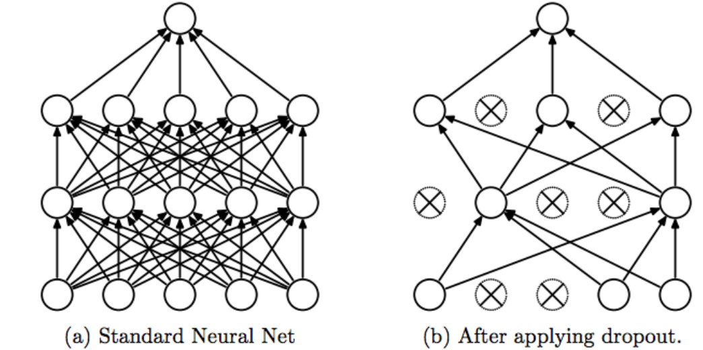
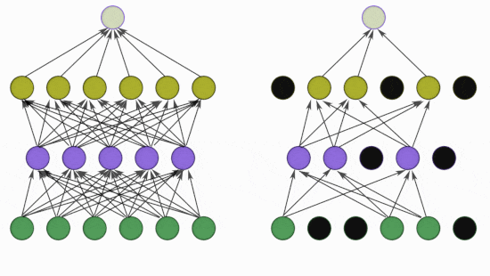

## Solutions to Overfitting
1. Add more data
2. Reduce Complexity
3. Early Stopping
4. Regularization
5. Dropout


# Dropout Layer 
Imagine you're teaching a classroom of students (your neural network) to solve problems. Normally, you'd have all students working together every time. But with dropout, you randomly send some students out of the room during each lesson.

<div style="display: flex; width: 100vw;">
  
  
</div>


Here's why this works:
- It prevents the class from relying too much on any one "star student"
- Forces the remaining students to pick up the slack
- Makes the whole group more adaptable

## How It Actually Works in Code

When you add dropout to a neural network layer, here's what happens:

```python
# This is how you'd write it in Keras
model.add(Dense(128, activation='relu'))  # A normal layer
model.add(Dropout(0.4))  # This randomly turns off 40% of neurons during training
```

During training:
- At each step, 40% of the neurons in that layer get temporarily turned off
- Different neurons get dropped each time
- During testing, all neurons stay on (but their outputs get scaled down by 40%)

## Why This Is So Useful

1. **Stops Overfitting**: Like preventing students from memorizing answers
2. **Makes the Network Tougher**: Forces it to develop multiple ways to solve problems
3. **Works With Everything**: Plays nice with other techniques like BatchNorm

## Practical Tips From Experience

- **Where to Use It**: After dense or convolutional layers
- **How Much to Drop**: Start with 0.2 (20%) and adjust
  - More complex networks can handle higher dropout (up to 0.5)
  - Simple networks might need less (0.1-0.3)
- **Watch for Signs**:
  - If your network isn't learning enough (underfitting), reduce dropout
  - If it's memorizing the training data (overfitting), increase dropout

## Common Mistakes to Avoid

1. Using dropout on every single layer (often too much)
2. `Forgetting that dropout is only active during training and at the testing time all nodes are active based on (1-p) probability`
3. Using very high dropout rates (>0.5) unless you have a good reason

Dropout is like giving your network "tough love" training - it might complain at first, but it'll perform better in the real world because of it.
