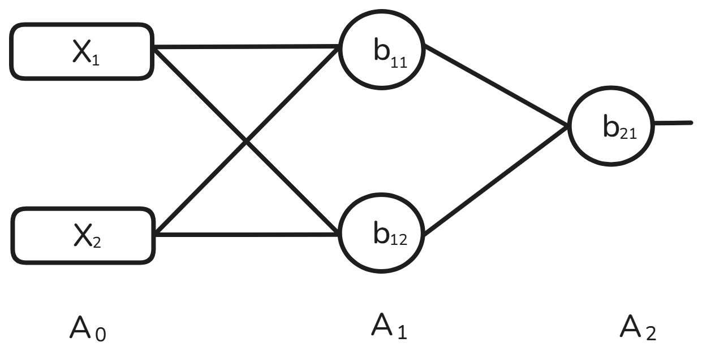

# Activation Functions

In ANN, each neuron froms a weighted sum of its inputs and passes the resulting scalar value through a function referred to as an activation function or transfer function. If a neuron has n inputs then the output or activation of a neuron is 

$a = g(w_1x_1 + w_2x_2 + w_3x_3 + \dots w_nx_n + b) $

This function g is referred to as the activation function.

If you can't apply the activation function then your neural network will not be able to capture the non-linear data.

The g function is taken as a linear function   g(z) = z. Then the neurons perform linear regression or classification. In general g is taken to be nonlinear fuction to do nonlinear regression and solve classification problem that are not linearly seperable. when g is taken sigmoidal the shape varying from 0 to 1 or -1 to 1 the output of the neuron can be interpreted as yes/no or binary value.

if you use the linear as an activation function then the neural network will work like a logistics regression in case of classification. 

Means linear is not an activation function?
I think its true

$ A_1 = W_1A_0 + b_1$

1. Sigmoid

2. Tanh

3. Relu

