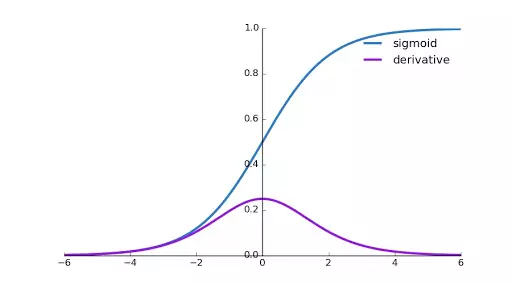
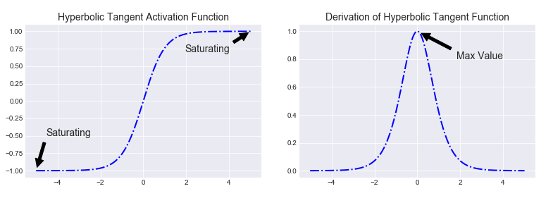
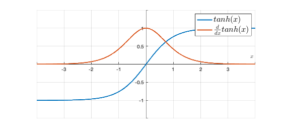
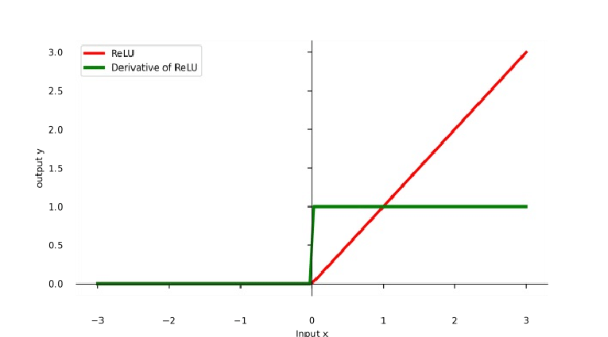

# The Complete Guide to Activation Functions in Neural Networks

## Understanding the Core Concept

At the heart of every neural network, activation functions serve as the decision-makers for each neuron. They take the weighted sum of inputs and determine how strongly that neuron should "fire". Here's why they matter:

### The Fundamental Equation

For any neuron with inputs (x₁, x₂, ..., xₙ), weights (w₁, w₂, ..., wₙ), and bias b:
$$ a = g(\sum_{i=1}^n w_ix_i + b) $$

Where **g** is our activation function - the critical component that introduces nonlinearity.

## Why Nonlinearity is Non-Negotiable

Without nonlinear activation functions, neural networks collapse into simple linear models:

$$
\begin{aligned}
Z_1 &= g(W_1X + b_1) \\
Z_2 &= g(W_2Z_1 + b_2) \\
\end{aligned}
$$

If **g** is linear, the entire network reduces to a single linear transformation! This is why we need nonlinear activations to:
- Model complex relationships
- Learn hierarchical features
- Solve problems that aren't linearly separable

## The Backpropagation Connection

Here's where activation functions make or break your training:

### The Gradient Calculation

During backpropagation, we compute weight updates using:
$$ W_{new} = W_{old} - \eta \cdot \frac{\partial L}{\partial W} $$

The critical term is the gradient:
$$ \frac{\partial L}{\partial W} = \frac{\partial L}{\partial a} \cdot \underbrace{\frac{\partial a}{\partial z}}_{\text{Activation derivative}} \cdot \frac{\partial z}{\partial W} $$

### The Vanishing Gradient Problem

For activation functions like sigmoid and tanh:
- Their derivatives approach zero at extremes (σ'(x) → 0 when |x| is large)
- In deep networks, these small derivatives multiply together
- Result: Gradients become vanishingly small in early layers

**Consequences**:
1. Early layers learn extremely slowly or not at all
2. Your deep network behaves like a shallow one
3. Training stalls prematurely

**Visualization**:
Imagine a classroom where:
- Each student (layer) whispers only 10% of what they hear to the next
- After 5 students, the message is almost gone
- The first student never gets proper feedback

## Popular Activation Functions Compared

### 1. Sigmoid (σ)

**Formula**: $σ(x) = \frac{1}{1 + e^{-x}}$

**Pros**:
- Outputs between 0-1 (interpretable as probability)
- Smooth, differentiable everywhere

**Cons**:
- Derivative peaks at 0.25 (σ'(0) = 0.25)
- Approaches 0 when |x| > 4 (vanishing gradients)
- Outputs not zero-centered (slower convergence)

### 2. Hyperbolic Tangent (tanh)

**Formula**: $tanh(x) = \frac{e^x - e^{-x}}{e^x + e^{-x}}$

 

**Improvements over sigmoid**:
- Zero-centered outputs (-1 to 1)
- Larger maximum derivative (tanh'(0) = 1)

**But still suffers from**:
- Vanishing gradients when |x| > 2
- Computationally expensive

### 3. ReLU (Rectified Linear Unit)

**Formula**: $ReLU(x) = max(0, x)$

**Why it's the default choice**:
- Derivative is 1 for all active neurons (x > 0)
- Completely avoids vanishing gradients in active paths
- Extremely fast to compute

**Watch out for**:
- "Dying ReLU" problem (neurons can get stuck at 0)
- Not differentiable at x=0 (handled in practice)
- Outputs not zero-centered

## Practical Implementation Guide

### Choosing Activations

**For hidden layers**:
1. Start with ReLU (works well in most cases)
2. If facing dying ReLU, try LeakyReLU or ELU
3. For very deep networks, consider Swish or GELU

**For output layers**:
- Binary classification: Sigmoid
- Multiclass: Softmax
- Regression: Linear (no activation)

### Troubleshooting Tips

**If facing vanishing gradients**:
1. Switch to ReLU or similar non-saturating activations
2. Add batch normalization
3. Consider residual connections

**If facing dying ReLU**:
1. Try LeakyReLU (small slope for x < 0)
2. Use proper initialization (He initialization)
3. Adjust learning rate

## Key Takeaways

1. Activation functions introduce the crucial nonlinearity that makes neural networks powerful
2. Their derivatives control gradient flow during backpropagation
3. Poor choices can lead to vanishing/exploding gradients
4. ReLU is the default choice for hidden layers, but alternatives exist
5. Always match your output activation to your problem type

Remember: The activation function is one of the most important hyperparameters in your network. Understanding how they work will help you diagnose training issues and build better models!