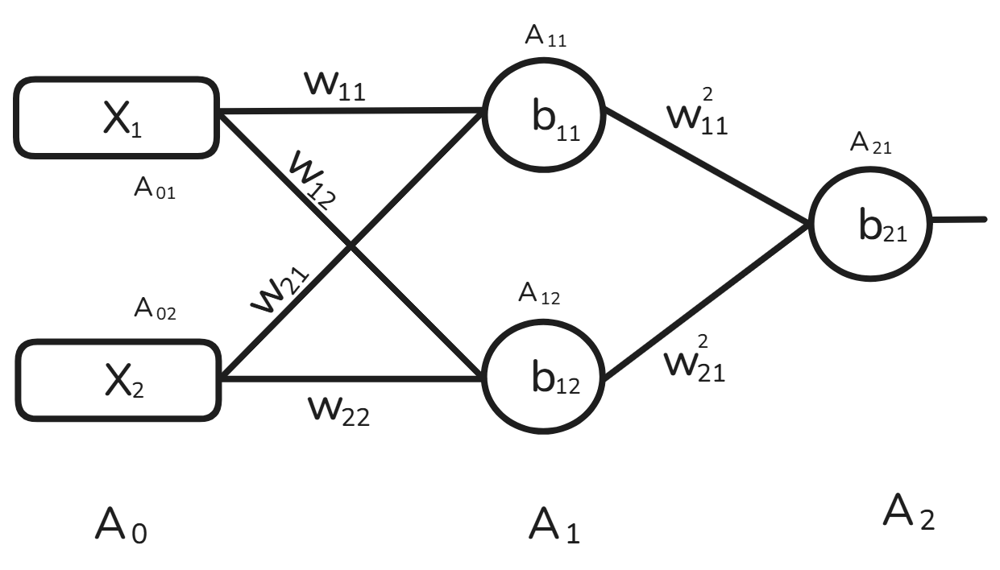

https://www.deeplearning.ai/ai-notes/initialization/index.html

# Neural Network Weight Initialization

## Overview of Weight Initialization Process

1. **Initialize the parameters**: Set the initial values for all the model parameters (weights and biases).
2. **Choose an optimization algorithm**: Select an algorithm for minimizing the cost function (e.g., Gradient Descent, Adam).
3. **Iterate through the following steps**:
    - **Forward propagate the input** through the network to calculate the output.
    - **Compute the cost function** to assess the model’s performance.
    - **Compute the gradients** of the cost with respect to the parameters using backpropagation.
    - **Update each parameter** using the gradients and the chosen optimization algorithm.

## Issues Caused by Incorrect Weight Initialization

Improper initialization of the weights can lead to several problems during training:

- **Vanishing Gradient Problem**: Gradients become too small for the model to learn effectively.
- **Exploding Gradient Problem**: Gradients become excessively large, leading to instability in learning.
- **Slow Convergence**: The model takes longer to converge to the optimal solution, which can hinder training.

## Common Weight Initialization Errors

### 1. Zero Initialization

Using zeros to initialize the weights can lead to significant issues in training. Below is a demonstration of what happens in different activation functions when weights are initialized to zero:

#### Example with ReLU:
- $A_{11} = \max(0, Z_{11}) = 0$
- $Z_{11} = W_{11}X_1 + W_{21}X_2 + b_{11} = 0$
- $A_{12} = \max(0, Z_{12}) = 0$
- $Z_{12} = W_{12}X_1 + W_{22}X_2 + b_{12} = 0$

In this case, since $A_{11} = A_{12} = 0$, the weights will not change during backpropagation, effectively leading to no learning, or a "zero trap."

#### Example with Tanh:
- $A_{11} = \frac{e^{Z_{11}} - e^{-Z_{11}}}{e^{Z_{11}} + e^{-Z_{11}}} = 0$

The tanh activation function will also output zero, leading to no update during backpropagation.

#### Example with Sigmoid:
If the initial weights are zero and the activation function is sigmoid, the derivative will not be zero, but the change will be so small that learning will still be effectively halted.

#### Example:
Consider a network with two inputs, one hidden layer with two neurons, and one output layer with a single neuron. If the weights are initialized to zero, the entire network will behave symmetrically, making it impossible for the network to break symmetry and learn meaningful features.

### 2. Non-Zero Constant Initialization

Using a non-zero constant (e.g., all weights initialized to the same value) also leads to issues similar to zero initialization, as the network can’t break symmetry, leading to stalled learning.

#### Example with Mathematical Explanation:
For instance, initializing all weights with the same constant value results in identical gradients for all weights, meaning no updates will differentiate them, hindering learning.

### 3. Random Initialization with Bias = 0

#### Small Random Values:
- **Tanh, Sigmoid**: Small random values can cause the vanishing gradient problem, making it difficult for the model to learn effectively.
- **ReLU**: While ReLU suffers less from vanishing gradients compared to tanh and sigmoid, training will still be very slow due to the smaller gradients.

#### Large Random Values:
- **Tanh, Sigmoid**: Large initial weights can lead to the exploding gradient problem, making the training unstable.
  
### Xavier/Glorot and He Initialization Techniques

To address the above issues, two initialization methods have been proven effective:

- **Xavier Initialization**: This method sets the weights based on the number of inputs and outputs. It works well with activation functions like **tanh** and **sigmoid**.
  

$$
  \text{Xavier Initialization (Normal)}: \mathcal{N}(0, \frac{2}{\text{fan\_in} + \text{fan\_out}})
$$

$$
  \text{Xavier Initialization (Uniform)}: \mathcal{U}\left(-\sqrt{\frac{6}{\text{fan\_in} + \text{fan\_out}}}, \sqrt{\frac{6}{\text{fan\_in} + \text{fan\_out}}}\right)
$$

- **He Initialization**: This method is specifically designed for ReLU activation functions and helps alleviate the vanishing gradient problem.
  

$$
  \text{He Initialization (Normal)}: \mathcal{N}(0, \frac{2}{\text{fan\_in}})
$$

$$
  \text{He Initialization (Uniform)}: \mathcal{U}\left(-\sqrt{\frac{6}{\text{fan\_in}}}, \sqrt{\frac{6}{\text{fan\_in}}}\right)
$$

Both Xavier and He initializations have implementations in Keras and other deep learning libraries.

## What to Avoid

- **Zero Initialization**: This results in no updates during training.
- **Non-Zero Constant Initialization**: Leads to symmetry and prevents breaking the symmetry during backpropagation.
- **Random Initialization with Small Weights**: This causes the vanishing gradient problem, making training very slow or even preventing convergence.
- **Random Initialization with Large Weights**: This causes the exploding gradient problem, leading to instability during training.

## Recommended Techniques

### Heuristic Solutions:
- **Xavier Initialization**: Best suited for **tanh** and **sigmoid** activation functions, though avoid sigmoid due to gradient vanishing issues.
- **He Initialization**: Best suited for **ReLU** activation functions to combat the vanishing gradient problem.

### Initialization Formulas:
- **Xavier Initialization**:
    - **Normal Distribution**: Weights are drawn from $\mathcal{N}(0, \frac{2}{\text{fan\_in} + \text{fan\_out}})$
    - **Uniform Distribution**: Weights are drawn from $\mathcal{U}\left(-\sqrt{\frac{6}{\text{fan\_in} + \text{fan\_out}}}, \sqrt{\frac{6}{\text{fan\_in} + \text{fan\_out}}}\right)$
  
- **He Initialization** (for ReLU):
    - **Normal Distribution**: Weights are drawn from $\mathcal{N}(0, \frac{2}{\text{fan\_in}})$
    - **Uniform Distribution**: Weights are drawn from $\mathcal{U}\left(-\sqrt{\frac{6}{\text{fan\_in}}}, \sqrt{\frac{6}{\text{fan\_in}}}\right)$

By adhering to these initialization methods and avoiding the common pitfalls, you can improve the efficiency and stability of your model training.

## LLM-Generated Example

### Consider a neural network with the following architecture:

- **Inputs**: $X_1$, $X_2$ (2 input features)
- **Hidden Layer**: 2 neurons, using ReLU activation
- **Output Layer**: 1 neuron, using sigmoid activation

#### Weights and Biases Initialization:
- We initialize the weights randomly using a small uniform distribution, with the bias initialized to zero.
  
#### Forward Pass:
- The input features are passed through the hidden layer neurons, where the weights are multiplied by the inputs, and the biases are added.
  
  For each hidden neuron:
  - $Z_1 = W_1 X_1 + W_2 X_2 + b_1$
  - $Z_2 = W_3 X_1 + W_4 X_2 + b_2$

- The activation for the hidden layer neurons is calculated using ReLU:
  - $A_1 = \max(0, Z_1)$
  - $A_2 = \max(0, Z_2)$

- The outputs of the hidden neurons are passed to the output neuron. The output layer applies the sigmoid activation:
  - $Z_{\text{out}} = W_5 A_1 + W_6 A_2 + b_{\text{out}}$
  - $A_{\text{out}} = \sigma(Z_{\text{out}})$

#### Backpropagation:
- The gradients of the cost with respect to the weights and biases are calculated through backpropagation. If weights were initialized to zero or constants, the network wouldn't learn because the gradients would not break symmetry.

#### Conclusion:
By initializing the weights properly (using Xavier or He initialization), this network would be able to break symmetry and effectively learn the underlying patterns during training, improving both convergence speed and overall performance.