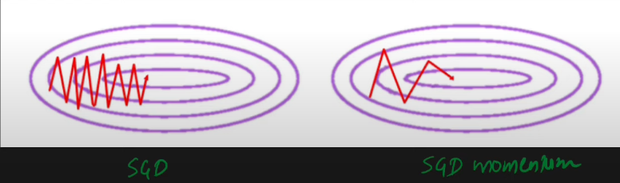

## Performance of Neural Networks

Previously, we discussed how we can improve the performance and speed up the training of Neural Networks (NN). So far, we have covered several techniques that help enhance both performance and training efficiency:

### Speed Up Techniques We Have Learned So Far:

- Weight Initialization
- Batch Normalization
- Activation Functions

Now, let's delve into **Optimizers**, another key aspect of improving neural network performance.

---

## 8.1. Introduction to Optimizers

[Repo + App: DL Optimizers Visualizer](https://github.com/lilipads/gradient_descent_viz/)

### Role of the Optimizer

The primary goal of an optimizer is to minimize the **loss function**, i.e., to improve the performance of the model by updating the weights to reduce the loss.

---

## 8.2 Types of Optimizers

- **Batch Gradient Descent (Batch GD)**: Involves computing the gradient of the entire dataset.
- **Stochastic Gradient Descent (SGD)**: Updates weights using only a single random sample at a time.
- **Mini-batch Gradient Descent**: A compromise between the previous two, using a small batch of data to compute the gradient.

---

## 8.3 Challenges in Gradient Descent

There are several challenges when using traditional gradient descent methods:

1. **Learning Rate**: A wrong learning rate can cause either slow convergence or failure to converge.
2. **Learning Rate Scheduling**: Finding the optimal schedule for updating the learning rate during training can be tricky.
3. **N-Dimensional Loss Functions**: When the loss function is n-dimensional, gradients in all directions might need different learning rates, making it hard to use the same learning rate for all dimensions.
4. **Local Minima**: In complex optimization landscapes, algorithms can get stuck in local minima. Stochastic gradient descent helps to escape local minima, but there is still a high probability of converging to suboptimal solutions.
5. **Saddle Points**: These are points where the gradient slopes upward in some directions and downward in others, causing difficulty in optimization.

Although conventional gradient descent can work, it often leads to slow training or suboptimal solutions. This is where more advanced optimizers come in.

### Advanced Optimizers:

1. **Momentum**  
2. **AdaGrad**  
3. **Nesterov Accelerated Gradient (NAG)**  
4. **RMSprop**  
5. **Adam**  

---

## Exponentially Weighted Moving Average (EWMA)

Exponentially Weighted Moving Average (EWMA) is a technique used to find hidden trends in time-series data. The weight of recent values increases exponentially, meaning that the average for more recent values is more influential.

### Formula:

$$
V_t = \beta V_{t-1} + (1 - \beta) \cdot \theta_t
$$

Where:
- $V_t$ is the weighted average at the current time step.
- $\beta$ is a constant between 0 and 1 (controls the weighting factor).
- $\theta_t$ is the current value.

### Intuition:
As you move forward in time, the weight of each new value increases, so the most recent data points have the greatest influence on the moving average.

---

## 1. SGD with Momentum (Momentum Optimization)

### Non-Convex Optimization & Why Momentum?

Momentum is used to accelerate optimization, particularly in scenarios with high curvature or noisy gradients. It helps to smooth out updates and avoid oscillations.

### How it Works:

Consider a situation where you're trying to move from point A to point B. If you ask four people for directions and two say "go right" and two say "go left", you may still move right but with less confidence. Momentum helps you maintain a stronger direction even when conflicting gradients appear.

From a physics perspective, think of a ball rolling down a parabola-like surface. As it moves down, it speeds up due to momentum. This concept is translated into optimization to accelerate convergence and smooth out the learning trajectory.



---

## 2. Nesterov Accelerated Gradient (NAG)

Nesterov Accelerated Gradient is an improvement over regular momentum, designed to address oscillations in the optimization path. It anticipates the future gradients based on momentum, which allows it to correct the path more effectively.

### Code Example:
```python
tf.keras.optimizers.SGD(
    learning_rate=0.01, momentum=0.0, nesterov=False, name="SGD", **kwargs
)
```

- **SGD**: Momentum parameter = 0, Nesterov = False
- **SGD with Momentum**: Momentum = 0.9, Nesterov = False
- **SGD with Nesterov**: Momentum = 0.9, Nesterov = True

---

## 3. AdaGrad

### Adaptive Gradient and Dynamic Learning Rate:

AdaGrad adjusts the learning rate for each parameter based on its historical gradient. It is especially useful when the features of the input data have different scales or when the features are sparse (leading to problems like the "elongated bowl" problem).

#### Advantages:
- Ideal for problems with sparse data (e.g., sparse matrices).
- Automatically adapts to feature-specific learning rates.

#### Disadvantage:
- AdaGrad's learning rate diminishes too quickly, meaning that after a certain number of updates, it can "stall" and fail to converge to the optimal solution.

### Intuition: 
In problems with sparse data, the contour plot tends to be elongated, meaning that gradients can be large in one direction and small in another. AdaGrad compensates by dynamically adjusting learning rates for each direction.

---

## 4. RMSprop

### Root Mean Square Propagation (RMSprop):

RMSprop is an improvement over AdaGrad and helps address the rapid decay of the learning rate. It divides the learning rate by an exponentially decaying average of squared gradients, allowing for more efficient convergence.

#### Disadvantage:
While RMSprop improves on AdaGrad's learning rate decay, it still faces challenges in very noisy optimization landscapes. However, it provides better convergence speed and stability.

---

## 5. Adam (Adaptive Moment Estimation)

Adam combines the advantages of both momentum and adaptive learning rate decay. It maintains running averages of both the gradients and the squared gradients and uses these to adaptively adjust the learning rate.

### Adam's Key Features:
- **Momentum**: Helps accelerate convergence by remembering past gradients.
- **Adaptive Learning Rates**: Adjusts learning rates based on the variance of the gradients.

Adam is widely regarded as one of the most powerful optimizers because it combines the best of both worlds: **momentum** and **learning rate decay**. It works well in many different scenarios, making it the go-to optimizer for a variety of deep learning tasks.

---

### Summary

- **Momentum and NAG**: Focus on accelerating the optimization process using momentum.
- **AdaGrad and RMSProp**: Focus on adjusting the learning rate based on the gradients.
- **Adam**: A combination of both momentum and learning rate decay, making it the most powerful and widely used optimizer.

These optimizers help address the challenges associated with conventional gradient descent, improving training speed, convergence, and stability.

