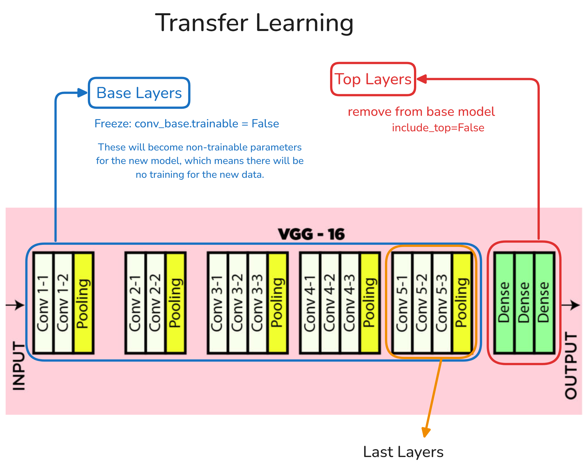

## Transfer Learning



## What is Transfer Learning?
Transfer learning is a research problem in machine learning that focuses on storing knowledge gained while solving one problem and applying it to a different but related problem.

Transfer learning is a machine learning technique where a model developed for one task is reused as the starting point for a model on a second task. It's like taking knowledge gained from solving one problem and applying it to a different but related problem.

### Key Concepts:
- **Source Task**: The original task the model was trained on
- **Target Task**: The new task we want to solve
- **Pretrained Model**: A model trained on the source task (usually on large datasets)
- **Fine-tuning**: Adapting the pretrained model to the target task

## Why Use Transfer Learning?

1. **Saves Time & Resources**: Training from scratch requires massive datasets and computing power
2. **Better Performance**: Pretrained models have learned useful features
3. **Works with Small Datasets**: Effective even when you have limited target data

*Example*: Using a model trained on ImageNet (1.2M images) to diagnose medical images (with only 10,000 images)

## Common Approaches

### 1. Feature Extraction
- Use pretrained model as a fixed feature extractor
- Remove final classification layer (i.e., Dense Layer(s))
- Add new classifier for your task

```python
base_model = tf.keras.applications.ResNet50(weights='imagenet', include_top=False)
features = base_model.predict(images)
```

### 2. Fine-Tuning
- Unfreeze some layers of pretrained model: Retrain the some last layers of the pretrained model
- Jointly train both new and existing layers

```python
base_model.trainable = True
# Fine-tune from this layer onwards
fine_tune_at = 100
for layer in base_model.layers[:fine_tune_at]:
    layer.trainable = False
```

## Popular Pretrained Models

| Model | Architecture | Best For |
|-------|-------------|----------|
| VGG16 | Simple, uniform | General vision tasks |
| ResNet | Residual connections | Deep networks |
| EfficientNet | Scaled architecture | Mobile/edge devices |
| BERT | Transformer | NLP tasks |

## Implementation Steps

1. **Choose a pretrained model** matching your input type (images, text, etc.)
2. **Remove the top layers** (original classifier)
3. **Add new layers** for your specific task
4. **Freeze base layers** (optional)
5. **Train** on your data
6. **Optionally unfreeze** some base layers for fine-tuning

```python
# Example using Keras
base_model = tf.keras.applications.MobileNetV2(
    input_shape=(224, 224, 3),
    include_top=False,
    weights='imagenet'
)

# Freeze the base model
base_model.trainable = False

# Add new classifier
model = tf.keras.Sequential([
    base_model,
    layers.GlobalAveragePooling2D(),
    layers.Dense(256, activation='relu'),
    layers.Dense(10, activation='softmax')  # 10 classes
])
```

## When to Use Transfer Learning

- **Do**:
    - Your dataset is small  
    - Your task is similar to the source task  
    - You have limited computing resources  

- **Don't**:
    - Your task is very different from the source task  
    - You have a massive dataset and resources  

## Practical Tips

1. **Input Preprocessing**: Match the pretrained model's expected input format
2. **Learning Rate**: Use lower learning rates for fine-tuning (e.g., 0.0001 vs 0.001)
3. **Layer Freezing**: Start with frozen layers, then gradually unfreeze
4. **Augmentation**: Use data augmentation when working with small datasets

## Common Applications

- Image classification (medical, satellite, etc.)
- Object detection
- Text classification
- Speech recognition
- Recommendation systems

*Example*: COVID-19 detection using chest X-rays with a pretrained ResNet model achieved 96% accuracy with only 500 training images.