# CNN (Convolutional Neural Network)

A **Convolutional Neural Network (CNN)** is a type of neural network specifically designed to process grid-like data structures, such as images (2D) or time series data (1D). It is particularly effective for tasks such as image recognition, classification, and object detection.

### Key Differences between CNN and ANN

- **ANN (Artificial Neural Network)**: Uses matrix multiplication for processing input data.
- **CNN**: Uses convolutional operations to extract features from the data.

A typical CNN consists of:
1. **Convolutional Layer**
2. **Pooling Layer**
3. **Fully Connected (FC) Layer**

### Why Not Use ANN for Image Data?

- **High Computation Cost**: Using ANN for image data can lead to very high computational costs.
- **Overfitting**: ANN is prone to overfitting, especially with image data.
- **Loss of Spatial Information**: ANN loses important spatial information (like the arrangement of pixels), which is critical in images.

For example, if you have a 40 x 40 image and 50 nodes in the hidden layer, the number of parameters in a fully connected layer will be 40 x 40 x 50 = 80,000. This makes ANN inefficient for large images.

### Convolutional Layers: Feature Extraction

Convolutional layers act as filters to extract important features from the image, such as edges, textures, and shapes. This is similar to how the human visual cortex processes images.

- **Visual Cortex**:
  - **Simple Cells**: Detect specific features, like orientation.
  - **Complex Cells**: Detect more complex features such as movement and depth.

### CNN vs Visual Cortex

An analogy is the human brain's visual cortex, which detects simple features like edges in the early stages and more complex patterns like shapes and objects later on. In CNNs, the initial layers focus on detecting simple features, while the deeper layers combine these features to identify more complex structures.

### Convolution Operation in CNN

CNNs use convolutional operations to detect patterns in images. A **kernel** (or filter) slides over the image to compute the feature map.


#### Example: Edge Detection

- **Vertical Edges + Horizontal Edges**: For example, detecting edges in a car image.
- **Edges** = Intensity: Edges in an image correspond to significant changes in intensity values.
- **Filter/Kernel Matrix Multiplication**: The process of applying a kernel to an image to detect specific features like edges.

In this example, the kernel is used to detect horizontal edges in an image of a car. The original image matrix is multiplied with a kernel (filter), and the result is the feature map.

- **Original Image**:

    ```
    [0   0   0   0   0   0]
    [0   0   0   0   0   0]
    [0   0   0   0   0   0]
    [255 255 255 255 255 255]
    [255 255 255 255 255 255]
    [255 255 255 255 255 255]
    ```

- **Kernel for Horizontal Edge Detection**:

    ```
    [-1  -1  -1]
    [ 0   0   0]
    [ 1   1   1]
    ```

- **Feature Map**: The result of the convolution is a feature map, which highlights horizontal edges.

```css
            [ 0   0   0   0   0   0 ]
            [ 0   0   0   0   0   0 ]
            [ 0   0   0   0   0   0 ]   *     [ -1  -1  -1 ]    =   Feature Map
            [255 255 255 255 255 255]         [  0   0   0 ]
            [255 255 255 255 255 255]         [  1   1   1 ]
            [255 255 255 255 255 255]
```

Scientists have designed various kernels to detect different types of edges, such as top edges, bottom edges, left edges, and right edges.

In deep learning, you don't need to manually design these kernels. Instead, the network learns the optimal values for the kernels during training via backpropagation. Essentially, these kernel values are just weights that are adjusted to find the best features for the task at hand.

[deeplizard.com | Convol Operation Visualizer](https://deeplizard.com/resource/pavq7noze2)

- **Finding the size of feature map**
    - Image (28 x 28 ) * kernal (3 x 3) = Feature Map (26 x 26)
    - Image (n  x  n ) * kernal (m x m) = Feature Map (n - m +1 ) x (n - m + 1) 

- **Filter Working Demo**
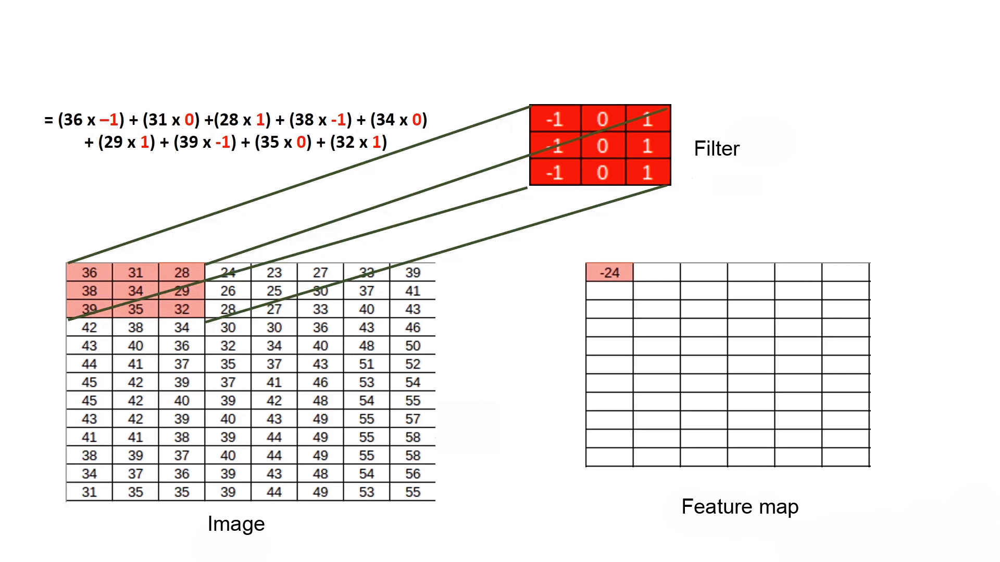


### Convolution Formula

To compute the feature map size after convolution:

$$
\text{Feature Map Size} = (n - m + 1) \times (n - m + 1)
$$

Where:
- $n$ is the size of the image,
- $m$ is the size of the kernel.

### Working with RGB Images

In RGB images, the kernel is 3D, with dimensions corresponding to the three color channels (Red, Green, Blue).

- **RGB Image Example**: An image of size 288 x 228 x 3 (height x width x channels).
- The kernel in this case will have dimensions $3 \times 3 \times 3$, where each of the 3 channels (RGB) is processed separately.

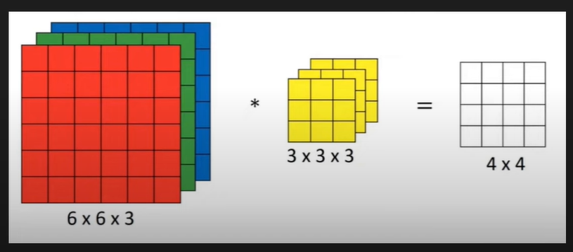

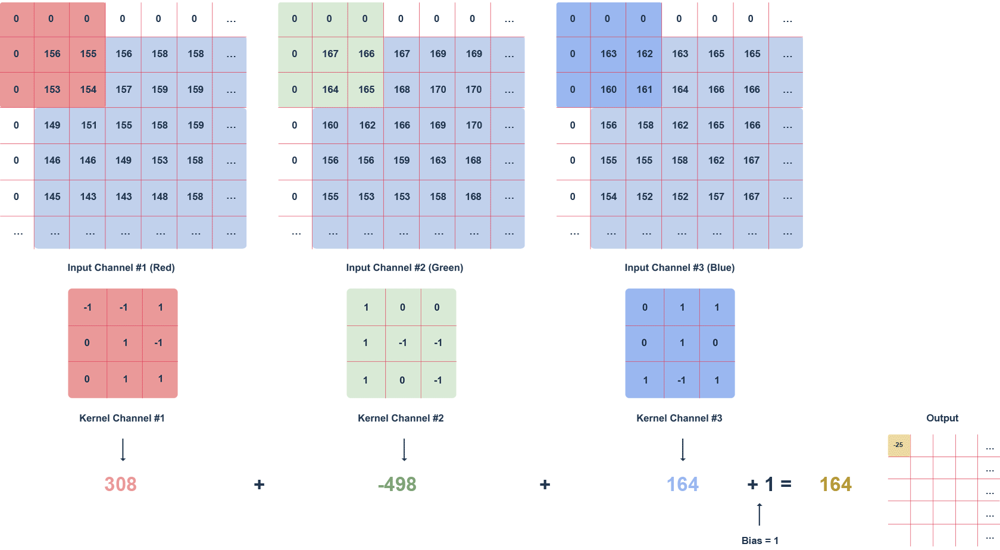

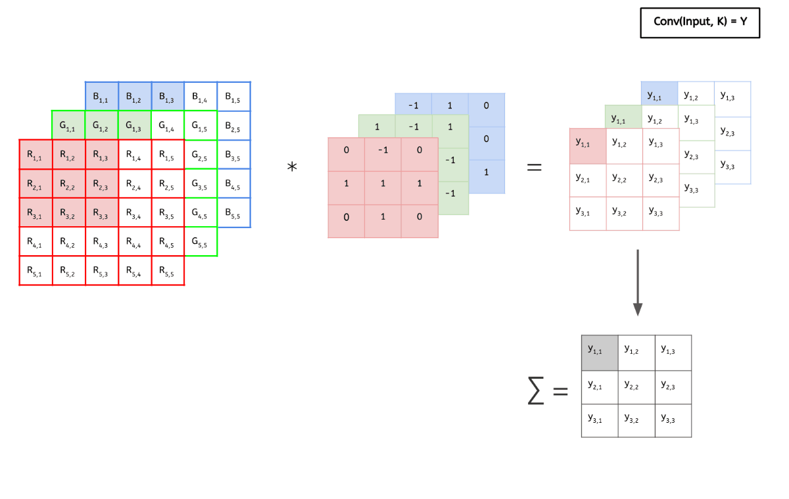

### Multiple Filters

CNNs use multiple filters to detect different features in the image. For example, one filter may detect vertical edges, while another detects horizontal edges.

$$
(m \times m \times c) * (n \times n \times c) = (m - n + 1) \times (m - n + 1) \times f
$$

Where:
- $c$ is the number of channels,
- $f$ is the number of filters.

### Padding and Strides in CNN

#### Padding

Padding is used to prevent the loss of important information during convolution. Without padding, the image size shrinks after each convolution operation.

- **Before padding**


- **After Zero Padding**


- **Zero Padding**: Add extra rows and columns (usually filled with zeros) around the image before applying convolution. This helps preserve the original size of the image.

**Formula for padding**:

Before padding:

$$
\text{Feature Map Size} = n - m + 1
$$

After padding:

$$
\text{Feature Map Size} = \frac{n + 2p - m}{s} + 1
$$

Where:
- $p$ is the padding,
- $s$ is the stride.

In Keras:
- **Valid Padding**: No padding, the traditional method.
- **Same Padding**: Keras automatically finds the optimal padding.

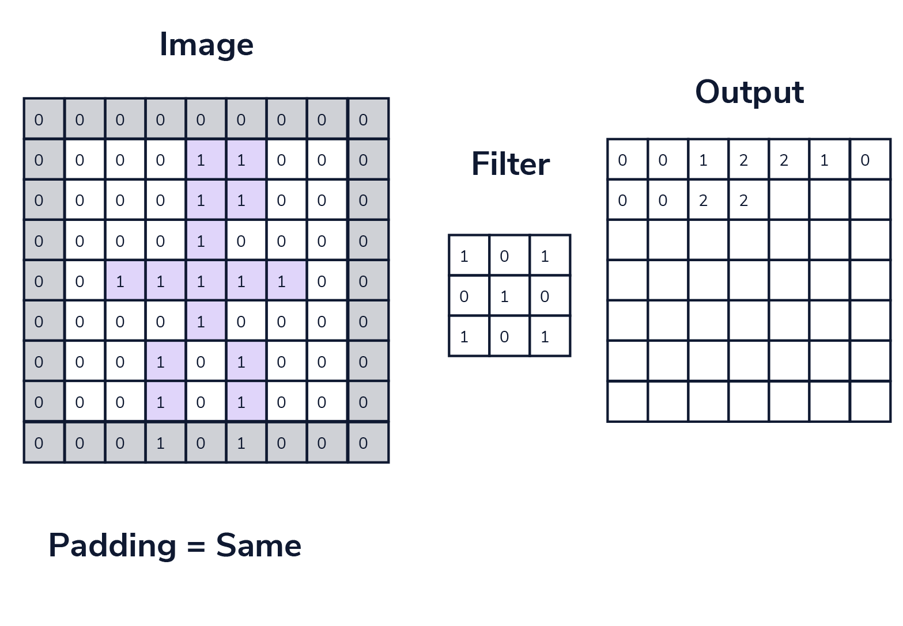

#### Strides

Strides control how much the kernel moves over the image. The stride determines how much the filter shifts during each operation.

- A stride of $(1, 1)$ means the kernel moves one step at a time in both horizontal and vertical directions.

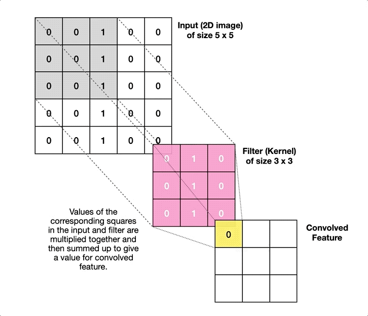

- Larger strides reduce the feature map size, making the model more computationally efficient but potentially losing some details.


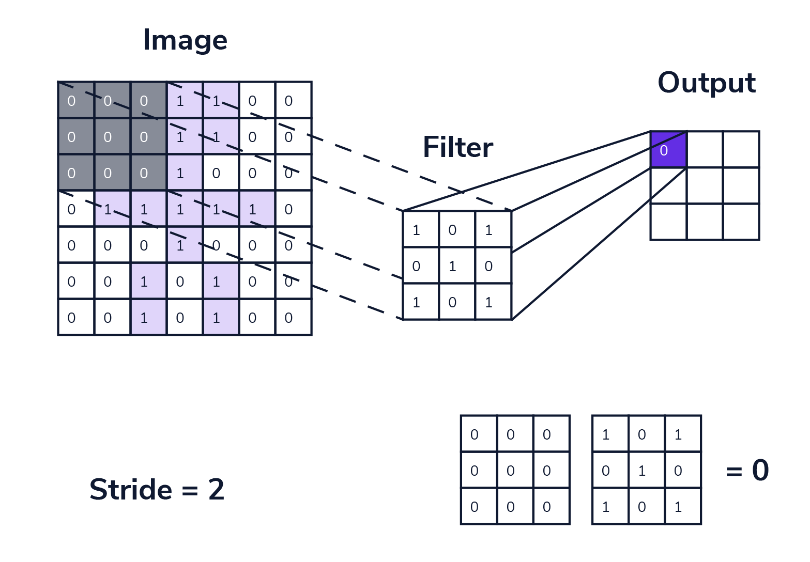

**Stride Formula**:

$$
\text{Feature Map Size} = \frac{n - m}{s} + 1
$$

Where $s$ is the stride size.


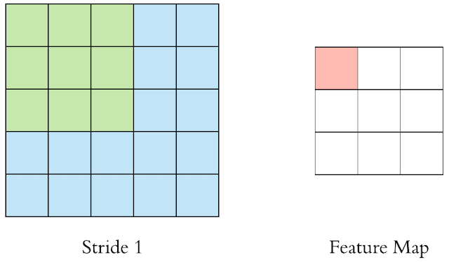
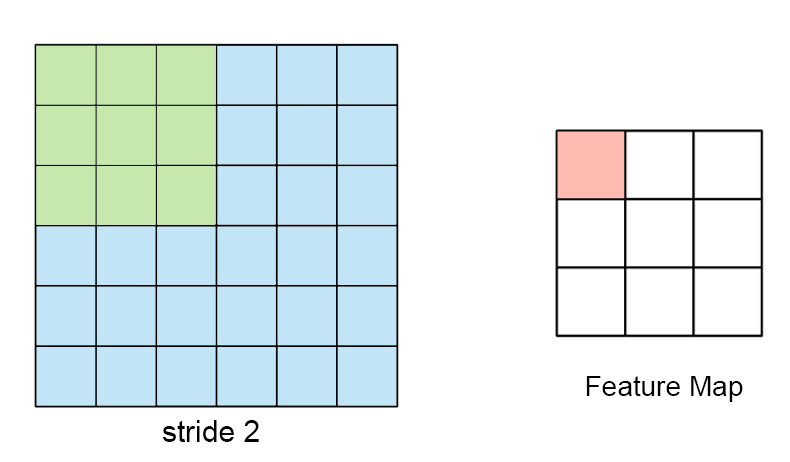


### Pooling Layer

The **Pooling Layer** is a crucial part of Convolutional Neural Networks (CNNs) used to reduce the size of the feature map while retaining important information. Pooling helps in reducing computation time, memory requirements, and overfitting. It also makes the model invariant to small translations of the input image.

#### Problems with Convolution:

1. **Memory Issues**: Convolution operations, especially on large images, can consume significant memory and may cause crashes or slow down processing.
2. **Translation Variance**: Convolution might be sensitive to small translations (shifts) in the image. Pooling helps in reducing this issue.

#### Types of Pooling:
There are different types of pooling techniques:
- **Max Pooling**: Takes the maximum value from a patch of the feature map. This helps in retaining the most prominent features.
- **Average Pooling**: Takes the average value from a patch of the feature map. This provides a smoother representation of features.
- **Min Pooling**: Takes the minimum value from a patch of the feature map.
- **L2 Pooling**: Uses the L2 norm to summarize the feature map.
- **Global Pooling**: Reduces the entire feature map into a single scalar value.

When configuring pooling, you need to specify:
- **Size** of the pooling window (e.g., 2x2).
- **Stride** (how much the window shifts).
- **Type** of pooling (max, average, etc.).

#### MaxPooling:
- **Trainable Parameters**: 0 (No parameters are learned because it simply selects the maximum value from a given window of the feature map).

#### Advantages of Pooling:
1. **Reduced Size**: Pooling reduces the size of the feature map, decreasing the number of computations and memory usage.
2. **Translation Invariance**: Pooling makes the model invariant to small translations (shifts) of the object within the image.
3. **Enhanced Features**: In **MaxPooling**, the dominant features from the local receptive field are retained, making the features stronger.
4. **No Training Needed in MaxPooling**: MaxPooling doesn't require any training to find the maximum value; it simply picks the largest value within each patch. This makes it computationally efficient and fast since there is no backpropagation involved in MaxPooling.

#### Pooling Types:

1. **Max Pooling**: Selects the maximum value from each patch.

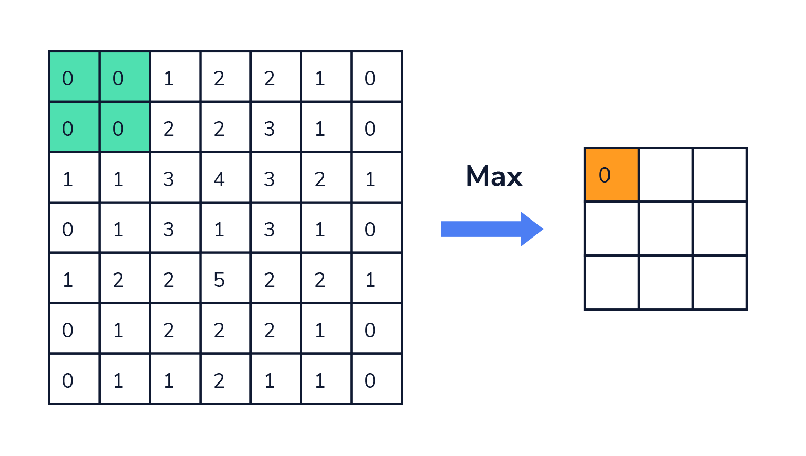

2. **Average Pooling**: Computes the average value from each patch.

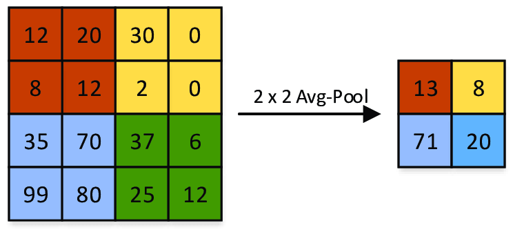


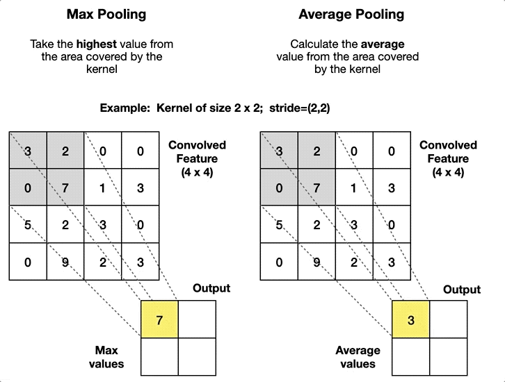

3. **Global Pooling**:
   - **Global Max Pooling**: Reduces the entire feature map into a scalar by taking the maximum value across the entire map.
   - **Global Average Pooling**: Computes the average value of all the numbers in the feature map.

For example, if you have 3 feature maps of size 4x4:
- Input: 4x4x3
- Output: 1x3 (after performing global pooling)

#### Global Pooling Use Case:
- Global pooling is often used before flattening the feature map to feed it into fully connected layers. This can help in reducing overfitting and preventing the model from becoming too complex.

#### Disadvantages of Pooling:
- **Translation Variance**: Pooling makes the network less sensitive to the precise location of features in the image. This is helpful for classification tasks but problematic for tasks where the exact location of an object is important (e.g., **object segmentation**).
- For tasks like **image segmentation**, where pixel-level predictions are needed, pooling can lose important spatial information. Hence, pooling is generally avoided in segmentation tasks.

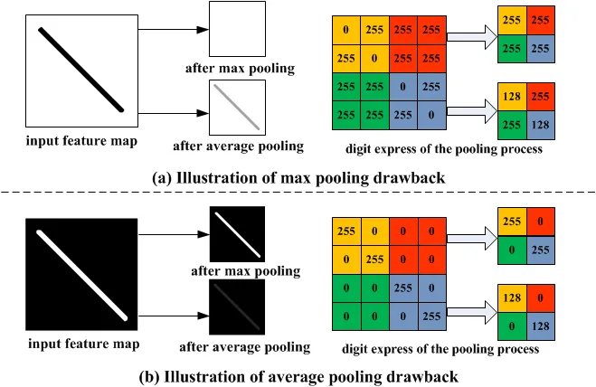

---

### CNN Architecture | LeNet-5 by Yann LeCun

LeNet-5 is one of the pioneering CNN architectures developed by Yann LeCun, primarily designed for handwritten digit recognition (MNIST). It utilizes the following components:
1. **Convolution Layers**: To extract features from the image.
2. **Pooling Layers**: To reduce the spatial dimensions of the image and keep important features.
3. **Fully Connected (FC) Layers**: To perform classification based on the extracted features.

LeNet-5 architecture includes:
- **Input**: 32x32 grayscale image.
- **Convolutional Layer**: Feature extraction.
- **Subsampling (Pooling) Layer**: Downsampling to reduce dimensionality.
- **Fully Connected Layer**: For classification.

#### ImageNet Competition
Over the years, several CNN architectures have been developed and used for large-scale image classification tasks, such as those in the ImageNet competition. These architectures include:

1. **LeNet-5**: Early CNN architecture for digit recognition.
2. **AlexNet**: A deeper and more powerful architecture that won the ImageNet competition in 2012.
3. **GoogleNet (Inception)**: Introduced the Inception module, allowing for more efficient and scalable networks.
4. **VGGNet**: Known for its simple and deep architecture with small filters (3x3) throughout.
5. **ResNet**: Introduced residual connections to overcome the vanishing gradient problem in deep networks.
6. **Inception**: A more complex network with multiple parallel convolutional operations.

---

### CNN vs ANN (Artificial Neural Network)

- **CNN (Convolutional Neural Network)**: Specifically designed for processing grid-like data (e.g., images) and extracting hierarchical features (e.g., edges, textures, shapes). CNNs use convolutional layers, pooling layers, and fully connected layers to perform tasks like classification and object detection.
  
- **ANN (Artificial Neural Network)**: A general-purpose neural network model that uses fully connected layers to process input data. While an ANN can be used on image data, it is less efficient compared to CNNs because it does not leverage spatial information and requires more parameters.

**Key Difference**: 
- CNNs are more specialized for image data and efficiently extract spatial features using convolution and pooling layers, whereas ANNs are more general and require a lot of parameters for image processing tasks.


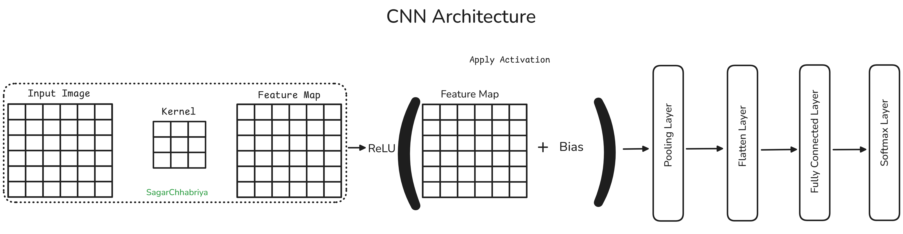


---

## Famous Architectures
- 2010: ML Model: 28% Error Rate
- 2011: ML Model: 25%
- 2012: AlexNet: 16.4%
- 2013: ZFNET: 11.7%
- 2014: VGG: 7.3%
- GoogleNet: 6.7%
- ResNet: 3.5%