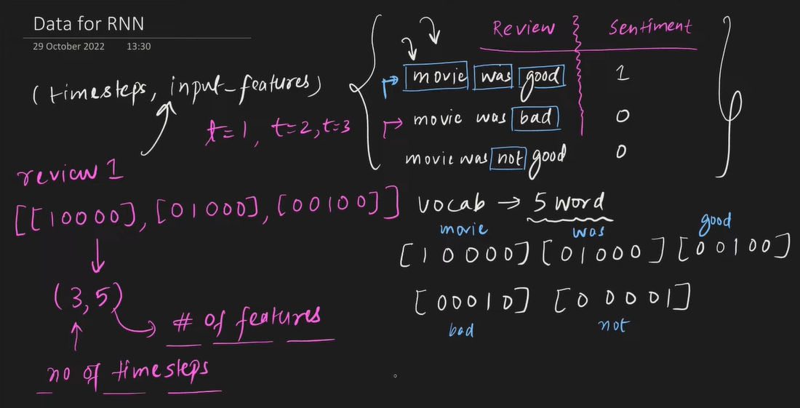

# RNN: Recurrent Neural Network
ANN --> Tabular Data
CNN --> Image data(grid like data)
RNN --> Sequential Data
RNN: A type of sequential model that works on sequential data.

Ex1: 
let's suppose we have 3 input columns in our data: Iq | Marks | gender and one output column placement

while feeding the data to a ANN: Iq, Marks, gender and marks, gender, Iq will not add any significant changes in the model becuase their sequence doesn't matter means it's a non-sequential data.
But what if we have a text message: Hi, my name is Sagar Chhabriya and I feed a NN Chhabriya my name sagar hi is?
sequence change means the loss of info. There comes the concept of sequential models although they were found in 1980s but became popular recently

Ex 2: Time series data
Ex 3: Speech data
Ex 4: DNA Sequence

and many more 

Applications:

https://text2data.com/
Next word predictor (Mask Intelligence)
Image caption generator: https://milhidaka.github.io/chainer-image-caption/
machine translation
Question and answering systems

Agenda:
Simple RNN
Backprop in RNN
LSTM, GRU
Types of RNN:
    - Deep RNN
    - Bidirectional RNNs

## Why RNNs

ANN: works on fixed input size

Default activation function in RNN or SimpleRNN Class

## RNN Sentiment Analysis 
- Integer Encoding
- Vector Embeddings

1. Integer Encoding(1,2,3,4...)
Vocab: Unique words in a corpus
    - assign an integer value to all the unique words
Ex: Hi there how are you
    1   2     3   4   5 

[1, 2]
[3, 4, 5]

diff dims: apply padding
[1, 2, 0]
[3, 4, 5]

2. Embedding
in natural language processing, word embedding is a term used for the representation or words for text analysis, typically in the form of a rela valued vector that encodes the meaning of the word such that the words that are closer in the vector space are expected to be similar in meaning. 

Sparse representation
dense representation: word2vec

IN deep learning we implement the embedding as layer in training

Embedding layer in keras: assumes data in integer encoded form

